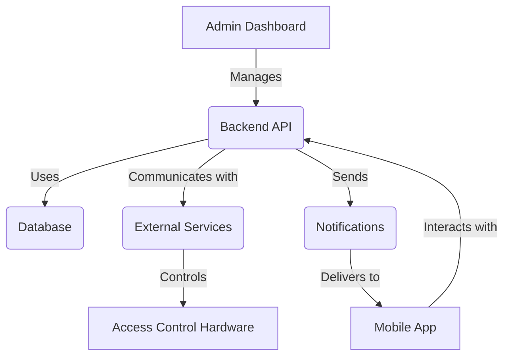
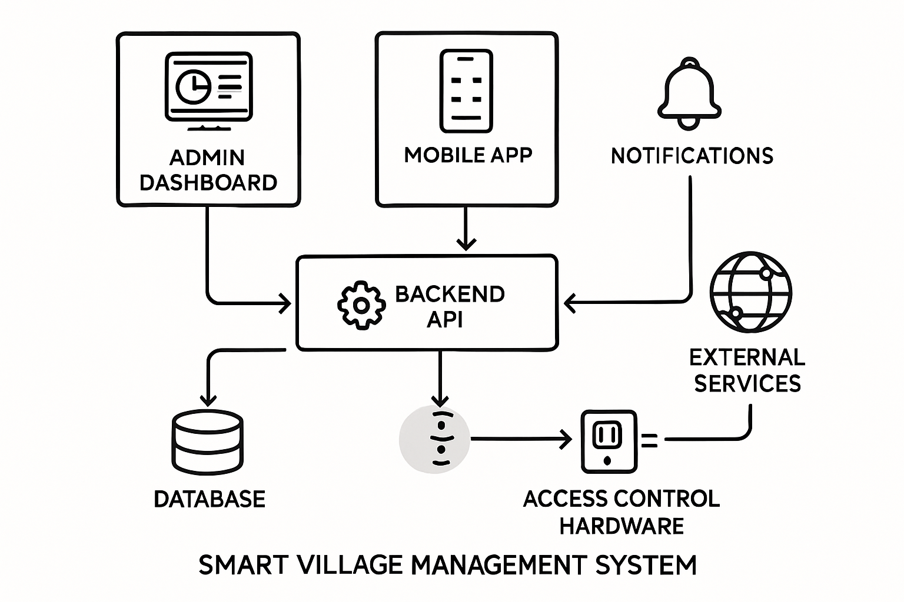

# Smart Village Management System: System Architecture

## 1. Overview

The Smart Village Management System is designed to provide a comprehensive solution for managing various aspects of a residential village, including financial transactions, access control, and resident communication. The system is built with scalability, security, and ease of use in mind, leveraging modern cloud-based technologies.

## 2. Core Principles

*   **Modularity**: The system is composed of independent, loosely coupled components to facilitate development, maintenance, and scaling.
*   **Scalability**: Designed to handle a growing number of users and data, supporting both single-village and multi-village deployments.
*   **Security**: Robust authentication, authorization, and data encryption mechanisms are implemented to protect sensitive information.
*   **User-Centric Design**: Intuitive interfaces for both administrators and residents.
*   **Real-time Capabilities**: Leveraging real-time databases and messaging for immediate updates and notifications.

## 3. High-Level Architecture

The system follows a microservices-oriented architecture, with distinct services handling specific functionalities. This allows for independent development, deployment, and scaling of each component.

## 4. Component Breakdown

### 4.1. User Interfaces

#### 4.1.1. Admin Dashboard

*   **Technology**: React.js
*   **Deployment**: Vercel
*   **Description**: A web-based interface for village administrators to manage residents, invoices, payments, expenses, access control, and generate reports. It provides a comprehensive overview and control panel for the entire system.

#### 4.1.2. Mobile Application

*   **Technology**: React Native
*   **Deployment**: Mobile App Stores (iOS/Android)
*   **Description**: A mobile application for residents to view their invoices, payment history, make payments, receive notifications, and interact with access control features (e.g., opening gates).

### 4.2. Backend Services

*   **Technology**: Node.js + Express or FastAPI (Python)
*   **Deployment**: Vercel Functions (for smaller functions) or dedicated server/container service for core APIs.
*   **Description**: A set of RESTful APIs that serve as the central hub for all data and business logic. Key modules include:
    *   **Authentication & Authorization**: Manages user logins, roles, and permissions (Firebase Authentication, JWT).
    *   **User Management**: Handles resident and admin profiles.
    *   **Invoice Management**: Generates, manages, and tracks invoices (manual and auto-generated).
    *   **Payment Processing**: Records payments, handles partial and overpayments, and integrates with payment gateways.
    *   **Expense Management**: Tracks village expenses.
    *   **Access Control Integration**: Communicates with external access control hardware (e.g., Hikvision ISAPI).
    *   **Notification Service**: Manages and sends notifications (Firebase Cloud Messaging).

### 4.3. Databases

*   **Primary Database**: Firebase Firestore
    *   **Description**: A NoSQL cloud database used for storing core application data, including user profiles, invoice details, payment records, and other transactional data. Its real-time capabilities are leveraged for immediate data synchronization.
*   **Real-time Data**: Firebase Realtime Database
    *   **Description**: Used for highly dynamic and real-time data, such as access control events (e.g., gate status, visitor logs) and instant notifications.

### 4.4. Authentication & Security

*   **Firebase Authentication**: Provides robust user authentication, supporting various login methods (email/password, social logins).
*   **JWT (JSON Web Tokens)**: Used for secure API communication, ensuring that only authorized users can access specific resources.

### 4.5. Storage

*   **Firebase Storage**: Used for storing unstructured data such as payment slips, resident photos, and other media files.

### 4.6. External Services & Integrations

*   **Firebase Cloud Messaging (FCM)**: For sending push notifications to mobile devices (invoices, payment reminders, access events).
*   **Hikvision ISAPI**: API for integrating with and controlling Hikvision access control hardware (e.g., gate barriers, cameras).
*   **Payment Gateway Integration**: (Future consideration) Integration with local payment gateways for online payment processing.
*   **Line OA Integration**: (Future consideration) For sending notifications and interacting with residents via Line Official Account.

## 5. Data Flow

1.  **User Interaction**: Residents or administrators interact with the Mobile App or Admin Dashboard.
2.  **API Calls**: User actions trigger API calls to the Backend Services.
3.  **Business Logic**: Backend Services process the requests, apply business rules, and interact with databases.
4.  **Database Operations**: Data is read from or written to Firebase Firestore or Realtime Database.
5.  **External Service Interaction**: Backend Services communicate with external systems like Hikvision ISAPI for access control or FCM for notifications.
6.  **Real-time Updates**: Changes in the database or external events trigger real-time updates to relevant user interfaces via Firebase's real-time capabilities.
7.  **Notifications**: FCM delivers push notifications to mobile devices based on system events.

## 6. Deployment Strategy

*   **Frontend (Admin Dashboard)**: Deployed on Vercel, leveraging its continuous integration/continuous deployment (CI/CD) capabilities for automated deployments from GitHub.
*   **Mobile Application**: Deployed to Apple App Store and Google Play Store.
*   **Backend Services**: Deployed as serverless functions on Vercel (for smaller, event-driven tasks) or on a scalable cloud platform (e.g., Google Cloud Run, AWS ECS) for more complex, long-running APIs.
*   **Databases**: Managed services provided by Firebase (Firestore, Realtime Database).

## 7. Future Considerations

*   **Advanced Analytics & Reporting**: Integration with data warehousing solutions for complex analytics.
*   **IoT Integration**: Expanding to integrate with other smart village devices.
*   **AI/ML Capabilities**: For predictive maintenance, anomaly detection, or enhanced security.

This architecture provides a solid foundation for building a robust, scalable, and user-friendly Smart Village Management System.

## 8. System Architecture Diagram

